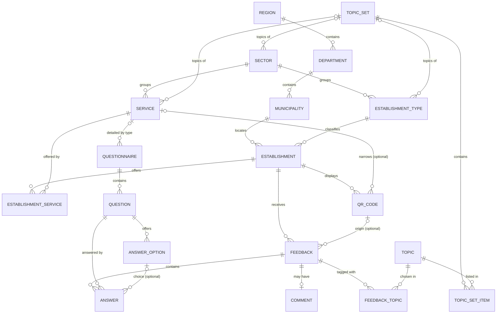

# Architecture de la base de données
Plateforme nationale de satisfaction des usagers des services publics (Sénégal)

Version de travail, construite en parallèle des maquettes (variante A).
Hypothèse technique : PostgreSQL, avec les extensions `pg_trgm` (recherche approchée) et `unaccent` (recherche sans accents).

Le schéma est créé par les migrations SQL de [`src/db/migrations/`](../src/db/migrations/) (`npm run db:migrate`). En cas d'écart entre ce document et les migrations, ce sont les migrations qui font foi.

**Règle des migrations :** les migrations ont été réécrites proprement le 2026-10-02, avant le lancement (`0001_schema.sql`, `0002_reference_data.sql`, `0003_registry.sql`, `0004_questions.sql`, base Neon réinitialisée). Depuis, toute modification passe par une nouvelle migration (`0005_establishment_types.sql` : types d'établissement), numérotée, sans jamais modifier une migration déjà appliquée.

## Convention de nommage

- Tout ce qui est dans la base est **en anglais** : tables, colonnes, valeurs d'énumération, codes.
- Noms en `snake_case`, tables au singulier (`establishment`, pas `establishments`).
- Clés étrangères : `<table>_id` (`establishment_id`).
- Dates : suffixe `_at` (`created_at`), booléens : préfixe `is_` (`is_active`).
- Les textes affichés à l'usager (libellés, questions) ne sont pas dans les colonnes de code : ils passent par une table de traduction propre à chaque table (`sector_translation`, `question_translation`…), une ligne par langue.
- Ce document reste rédigé en français ; seuls les identifiants sont en anglais.
- Les valeurs d'énumération sont stockées en `text` avec une contrainte `CHECK`, plus simples à faire évoluer que les types `ENUM` de PostgreSQL.

---

## 1. Principes

1. **L'établissement est au centre.** Un avis porte toujours sur un établissement. Le service est une information complémentaire.
2. **Anonymat.** Aucune donnée personnelle n'est stockée : pas de nom, de téléphone, d'adresse IP ni d'identifiant d'appareil durable.
3. **Enregistrement immédiat.** Chaque réponse est enregistrée dès qu'elle est donnée. Un avis abandonné juste après la question essentielle reste exploitable.
4. **Jamais d'impasse.** Un usager peut saisir un établissement absent du référentiel. Celui-ci est créé avec le statut `pending_review`.
5. **Questionnaires versionnés.** On ne modifie jamais une question déjà utilisée : on crée une nouvelle version. Les anciens avis restent lisibles.
6. **Multilingue.** Tous les textes affichés à l'usager ont une traduction par langue.

---

## 2. Vue d'ensemble

Les tables se répartissent en quatre blocs :

| Bloc | Tables | Rôle |
|---|---|---|
| Référentiel | region, department, municipality, sector, establishment_type, establishment, service, establishment_service, qr_code | Ce que l'usager cherche et évalue |
| Questions | question (banque), answer_option, question_set, question_set_item, question_condition, topic, topic_set, topic_set_item, tables `*_translation` | Ce qu'on demande à l'usager |
| Collecte | feedback, answer, comment, feedback_topic | Ce que l'usager répond |
| Exploitation | monthly_stats (vue), search_log, moderation_action | Résultats publiés, amélioration du référentiel |

---

## 3. Référentiel

### region, department, municipality
Découpage administratif (région, département, commune), chargé une fois et mis à jour rarement.

| Colonne | Type | Note |
|---|---|---|
| id | smallint / int | clé |
| code | text | code officiel |
| name | text | |
| region_id / department_id | fk | parent |

### Classement : secteur, type, établissement

Trois niveaux, du plus général au plus précis :

| Niveau | Table | Question | Exemples |
|---|---|---|---|
| Secteur | `sector` | Dans quel domaine ? | Santé, Éducation, Administration |
| Type d'établissement | `establishment_type` | Quel genre de lieu ? | Hôpital, poste de santé, lycée, mairie, centre d'état civil |
| Établissement | `establishment` | Quel lieu précis ? | Hôpital Le Dantec, Mairie de Grand-Yoff |

Le caractère **public ou privé** n'est ni un secteur ni un type : un hôpital ou une école peuvent être publics ou privés. C'est donc une propriété de chaque établissement (`establishment.ownership`).

### sector
Domaine général. Partagé par les types d'établissement et par les services.

| Colonne | Type | Note |
|---|---|---|
| id | smallint | |
| code | text unique | `HEALTH`, `EDUCATION`, `ADMINISTRATION`, `JUSTICE`, `SECURITY`, `TAX`, `ELECTRICITY`, `WATER`, `TRANSPORT`, `SOCIAL`, `FOOD_SERVICE`, `HOSPITALITY`, `REAL_ESTATE`, `RETAIL`, `BANKING_INSURANCE`, `CULTURE`, `SPORT`, `TELECOM`, `TOURISM` (agences de voyages, guides, sites touristiques ; l'hébergement reste en `HOSPITALITY`, les musées en `CULTURE`). `ELECTRICITY` et `WATER` sont deux secteurs (décision du 2026-09-29). Un secteur n'est ni public ni privé : c'est `establishment.ownership` qui le précise |
| question_set_id | fk question_set | liste de questions du secteur (écran 6), facultative |

Le libellé affiché passe par sa table de traduction (`*_translation`).

### establishment_type
Genre de lieu : mairie, centre d'état civil, hôpital, poste de santé, école primaire, lycée, commissariat, etc.

| Colonne | Type | Note |
|---|---|---|
| id | int | |
| code | text unique | `TOWN_HALL`, `CIVIL_REGISTRY_CENTER`, `HOSPITAL`, `HEALTH_POST`, `PRIMARY_SCHOOL`… |
| sector_id | fk sector | |
| question_set_id | fk question_set | liste de questions du type, ajoutée à celle du secteur (facultative) |

Le libellé affiché passe par sa table de traduction (`*_translation`).

**Un seul type par établissement** (pour comparer ce qui est comparable).

**Règle (validée le 2026-10-02) : un type n'existe que s'il apporte quelque chose** que ni le secteur, ni l'organisme, ni le service n'apportent déjà :
1. regrouper des lieux qui ne le sont pas autrement, pour les comparer (pas d'organisme commun, secteur qui mélange des lieux très différents : hôpital et pharmacie) ;
2. ou poser des questions propres à ce genre de lieu.

Exemples écartés par la règle : « Agence commerciale » (Senelec regroupe déjà ses agences), « Ligne de bus », « Gare ferroviaire », « Bateau » (l'opérateur regroupe, les services « Un trajet », « Une traversée » posent les questions). Types validés le 2026-10-02 (migration `0005`) :

| Secteur | Types |
|---|---|
| Santé | Hôpital, Centre de santé, Poste de santé, Clinique (avec lits : séjour, opération, accouchement), Cabinet médical ou dentaire (consultation seulement), Laboratoire d'analyses, Centre d'imagerie médicale, Pharmacie |
| Administration | Mairie, Centre d'état civil (centre secondaire, séparé de la mairie), Préfecture, Sous-préfecture, Centre de carte d'identité ou de passeport, Inspection d'académie, Inspection de l'éducation et de la formation (IEF) (des bureaux de démarches : questions des services à dossier, pas celles de la classe) |
| Éducation | Case des tout-petits ou école maternelle, École élémentaire, Collège (CEM), Lycée, Groupe scolaire (plusieurs niveaux), Université, École ou institut d'enseignement supérieur, Centre de formation professionnelle, Daara |
| Justice | Tribunal ou cour (tous les niveaux : le nom dit lequel), Maison de justice, Étude de notaire, Étude d'huissier, Cabinet d'avocat |
| Sécurité | Commissariat de police, Poste de police, Brigade de gendarmerie |
| Impôts et domaines | Centre des services fiscaux, Service des domaines, Service du cadastre, Conservation foncière, Bureau des douanes, Perception du Trésor |
| Emploi et protection sociale | Agence de sécurité sociale ou de retraite, Inspection du travail, Service de l'emploi, Service de l'action sociale, Centre de promotion et de réinsertion sociale |
| Transport | Aéroport, Gare routière, Centre des permis et cartes grises (avec la liste des services à dossier, le secteur Transport n'en ayant pas) |
| Commerce | Marché (même géré par la mairie), Supermarché, Boutique de quartier, Station-service ; les autres boutiques sans type |
| Culture | Musée, Bibliothèque, Centre culturel, Cinéma ou salle de spectacle |
| Sport | Stade ou arène (lutte comprise), Salle de sport, Piscine |
| Tourisme | Agence de voyages, Site touristique (pas les guides : des personnes) |
| Électricité, Eau, Télécoms | aucun : l'organisme (Senelec, Orange…) regroupe déjà ses agences |
| Restauration, Hôtellerie, Immobilier, Banques et assurances | aucun : lieux semblables, ou regroupés par leur organisme ; pour les hôtels, une catégorie en étoiles plus tard ; pas de type pour les points de mobile money (on évalue Wave ou Orange Money en général) |

Écartés : Case de santé ; établissement pénitentiaire (à voir avec l'organisme porteur) ; Gouvernance et Conseil départemental (pas de guichet courant pour l'usager) ; École franco-arabe (elle prend le type de son niveau, « franco-arabe » va dans ses alias). Les 18 lieux publics de `0003` ont reçu leur type (hôpitaux, mairies, DAF, universités, lycée). Tous les secteurs sont faits (59 types, Aéroport compris). Le type **n'est pas affiché** sous le nom (redondant avec le nom, écarté le 2026-10-02) : on garde commune et secteur.

À quoi sert le type :
1. **Comparer ce qui est comparable.** Les statistiques et les classements publiés comparent un hôpital à d'autres hôpitaux, pas à un poste de santé.
2. **Afficher un repère dans la recherche.** Sous le nom de l'établissement, on affiche son type (« Poste de santé ») pour lever les ambiguïtés entre lieux aux noms proches.
3. **Ajouter des questions propres au type.** Un type peut avoir sa liste de questions, ajoutée à celle du secteur (par exemple, plus tard, des questions d'aéroport).
4. **Préremplir les services.** À la création d'un établissement dans le référentiel, on peut proposer les services habituels de son type (une mairie propose l'état civil).
5. **Écran 0c.** Le champ facultatif « Type » que remplit l'usager correspond à `establishment_type`.

### establishment
| Colonne | Type | Note |
|---|---|---|
| id | uuid | |
| name | text | nom officiel affiché |
| aliases | text[] | autres noms de l'établissement (voir plus bas) |
| search_text | text | nom + alias, en minuscules et sans accents, rempli automatiquement (index trigramme) |
| type_id | fk establishment_type | nullable si saisi par un usager |
| organization_id | fk organization | organisme auquel appartient l'établissement (une agence Senelec pointe vers Senelec) ; vide pour un établissement indépendant |
| scope | enum | `site` (lieu physique, par défaut) ou `general` (l'organisme « en général », sans lieu : voir `organization`) |
| sector_id | fk sector | secteur quand le type est inconnu : choisi par l'usager à l'écran 0c (facultatif). Si les deux existent, le secteur du type prime |
| ownership | enum | `public`, `private`, `community` (établissements communautaires, confessionnels…) |
| municipality_id | fk municipality | nullable si saisi par un usager |
| address | text | facultatif |
| status | enum | `active`, `pending_review`, `rejected`, `merged`, `closed` |
| closed_at | timestamptz | date de fermeture (status = closed) |
| source | enum | `registry`, `user` |
| raw_input | text | texte tapé par l'usager (source = user) |
| municipality_input | text | commune tapée librement par l'usager |
| merged_into_id | fk establishment | si c'était un doublon d'un établissement existant |
| created_at, updated_at | timestamptz | |

Un établissement saisi par un usager (écran 0c) est créé avec `status = pending_review` et `source = user`. L'avis y est rattaché tout de suite. Après vérification, l'établissement est soit validé (`active`), soit rattaché à un existant (`merged`, et ses avis suivent), soit rejeté (`rejected`).

Un établissement qui ferme ses portes passe en `closed` et on renseigne `closed_at`. On ne le supprime jamais :
- ses avis passés restent dans la base et dans les statistiques des mois où il était ouvert ;
- il n'est plus proposé dans la recherche ;
- ses QR codes sont désactivés (`is_active = false`). Un QR code encore affiché mène à un message « Cet établissement est fermé » au lieu du formulaire.

Résumé des statuts :

| status | Proposé dans la recherche | Accepte de nouveaux avis | Avis conservés |
|---|---|---|---|
| `active` | oui | oui | oui |
| `pending_review` | non | oui (celui qui l'a créé) | oui |
| `rejected` | non | non | oui, mis de côté |
| `merged` | non (on propose celui qui le remplace) | non | oui, rattachés au remplaçant |
| `closed` | non | non | oui |

### Alias (colonne `establishment.aliases`)
Autres noms sous lesquels les gens connaissent **un établissement précis**. Le nom officiel ne suffit pas : l'usager tape le nom qu'il utilise au quotidien.

Exemples :

| name (nom officiel) | aliases |
|---|---|
| Centre hospitalier universitaire Aristide Le Dantec | {Le Dantec, hôpital Le Dantec} |
| Hôpital Principal de Dakar | {Principal, hôpital militaire} |
| Centre d'état civil de Grand-Yoff | {mairie de Grand-Yoff, état civil Grand-Yoff} |

- Un établissement peut avoir autant d'alias que nécessaire : chaque alias est un élément de la liste.
- Un alias désigne toujours **un seul** établissement.
- `search_text` est recalculé automatiquement (trigger ou colonne générée) à chaque modification de `name` ou `aliases`. C'est le seul champ utilisé pour chercher un établissement par son nom.

**D'où viennent les alias :** de l'import du référentiel officiel (sigles, noms courts) et de la saisie par les agents dans l'outil d'administration. Quand un agent fusionne un établissement saisi par un usager (`merged`), il peut ajouter à la main le texte tapé par l'usager (`raw_input`) aux alias de l'établissement retenu.

Si plus tard on veut que la plateforme propose des alias automatiquement à partir des recherches, il faudra une table dédiée (avec la source et le statut de validation de chaque alias).

### service
Catalogue national des services : état civil (extrait de naissance, mariage…), consultations, inscription scolaire, etc.

| Colonne | Type | Note |
|---|---|---|
| id | int | |
| code | text unique | `CIVIL_REGISTRY_BIRTH` |
| sector_id | fk sector | domaine du service |
| question_set_id | fk question_set | liste de questions du service, ajoutée à celles du secteur et du type (facultative) |
| synonyms | text[] | mots que l'usager peut taper pour désigner ce service (voir plus bas) |
| search_text | text | libellé français + synonymes, en minuscules et sans accents, rempli automatiquement (index trigramme) |

### Synonymes (colonne `service.synonyms`)
Mots que l'usager peut taper pour désigner **un type de service**, et non un lieu. Un synonyme mène donc à **plusieurs** établissements : tous ceux qui proposent ce service.

Exemples :

| code | synonyms |
|---|---|
| CIVIL_REGISTRY_BIRTH | {état civil, extrait de naissance, acte de naissance, déclaration de naissance} |
| CIVIL_REGISTRY_MARRIAGE | {mariage, acte de mariage} |
| HEALTH_CONSULTATION | {consultation, médecin, dispensaire} |

- Les synonymes peuvent être en français ou en langues nationales, mélangés dans la même liste : la recherche porte sur tous, quelle que soit la langue.
- Ce sont des données, pas des identifiants : ils ne suivent pas la règle « tout en anglais ».
- `search_text` est recalculé automatiquement à chaque modification du libellé ou des synonymes, comme pour les établissements.

Quand l'usager tape « extrait de naissance », la recherche reconnaît le service CIVIL_REGISTRY_BIRTH, puis renvoie les établissements qui le proposent (via `establishment_service`). C'est dans ce cas que l'écran 0a affiche l'encadré « Précisez l'établissement ».

**Différence avec les alias :** un alias est un autre nom d'**un** établissement (« Le Dantec » → un seul hôpital). Un synonyme est un autre nom d'**un service** (« extrait de naissance » → toutes les mairies et centres d'état civil).

### establishment_service
Quels services chaque établissement propose (relation plusieurs à plusieurs).

| Colonne | Type |
|---|---|
| establishment_id | fk |
| service_id | fk |

### qr_code
Un QR code par guichet ou par établissement.

| Colonne | Type | Note |
|---|---|---|
| id | uuid | |
| code | text unique | court, contenu dans l'URL du QR |
| establishment_id | fk | obligatoire |
| service_id | fk | facultatif : un QR peut viser un guichet précis |
| location_label | text | « Guichet 2 », « Hall d'entrée » |
| is_active | boolean | |

---

### organization
Organisme qui a plusieurs établissements : Senelec, Sen'Eau, La Poste, opérateurs téléphoniques, caisses sociales, impôts…

| Colonne | Type | Note |
|---|---|---|
| id | smallint | |
| code | text unique | `SENELEC`… |
| name | text | nom usuel, affiché partout : Senelec |
| full_name | text | nom complet officiel quand il diffère : Société nationale d'électricité du Sénégal |
| sector_id | fk sector | |

Le nom complet, les sigles et les anciens noms (Free pour Yas, SGBS pour Société Générale) sont aussi des **alias** de l'établissement « en général » : ils le font trouver par la recherche.

Organismes (listes validées le 2026-09-29 et le 2026-10-02) : Senelec, Sen'Eau, Orange, Yas, Expresso, La Poste (secteur Télécoms), IPRES, DGID, CBAO, UBA, Société Générale ; transport : Dem Dikk (anciennement Dakar Dem Dikk), BRT, TER, AFTU, COSAMA (et son bateau Aline Sitoë Diatta).

Un organisme s'évalue de deux façons :
- **dans une de ses agences** : un établissement ordinaire (`scope = site`) rattaché à l'organisme ;
- **« en général »** (coupures, factures, service client, application…) : un établissement particulier de l'organisme, `scope = general`, sans adresse ni commune. Un seul par organisme, jamais de QR code (règles vérifiées par la base).

Chaque avis reste ainsi rattaché à un établissement. Dans la recherche, à score égal, l'organisme « en général » passe avant ses agences ; une commune tapée fait passer l'agence de cette commune en tête.

**Note globale d'un organisme** (décision du 2026-09-29) : tous les avis de tous ses établissements regroupés (« en général » et agences), avec le détail par établissement.

**Écran 1** : depuis le 2026-10-01, mêmes textes pour un lieu et pour un organisme « en général » : « À quand remonte votre expérience ? » (mêmes réponses, même calcul du mois) et « Sur quoi porte votre avis ? ».

## 4. Recherche d'établissement (écrans 0 et 0a)

La recherche porte sur l'établissement. En arrière-plan, le texte tapé est comparé à trois sources :

1. **Nom et alias de l'établissement** (`establishment.search_text`) : correspondance approchée (trigrammes, avec `word_similarity` pour ne pas pénaliser les textes longs), sans accents.
2. **Libellés et synonymes de service** (`service.search_text`) : si le texte correspond à un service (« état civil »), on renvoie les établissements qui proposent ce service, via `establishment_service`.
3. **Commune** (`municipality.name`) : si le texte contient un nom de commune (« état civil Grand-Yoff »), on classe d'abord les établissements de cette commune.

La réponse de l'API indique au front si le texte ressemble à un service (`match_type = service`). C'est ce qui déclenche l'encadré « Précisez l'établissement » dans l'écran 0a.

Quand rien n'est trouvé, une recherche plus souple compare chaque mot de 3 lettres ou plus séparément et propose au plus 3 établissements (« Vouliez-vous dire », écran 0b). Le comportement complet des écrans est décrit dans `docs/parcours-recherche.md`.

Seuls les établissements au statut `active` sont proposés. Ceux en `pending_review` ne le sont pas, pour éviter de diffuser des doublons ou des erreurs, et ceux en `closed` non plus.

Index à prévoir :
- `gin (search_text gin_trgm_ops)` sur establishment ;
- `gin (search_text gin_trgm_ops)` sur service.

---

## 5. Questions

Réorganisées le 2026-10-02, avant le lancement (validé sur la page « Questionnaires par niveau ») : **une banque de questions**, chaque question écrite une seule fois, et des **listes** de questions rattachées aux niveaux. À l'écran 6, les listes du **secteur**, puis du **type**, puis du **service** s'additionnent, du plus général au plus spécifique. Une question présente dans plusieurs listes est la même question : ses réponses se comparent d'un secteur à l'autre.

**Règle de rangement** : une question se place au niveau le plus général où elle vaut pour tous ceux qui sont en dessous ; si un seul cas ne doit pas l'avoir, on la descend d'un niveau (les questions de bus sont sur le service « Un trajet en bus ou en train », pas sur le secteur Transport). Un niveau sans liste n'ajoute rien.

**Listes spéciales** (trouvées par leur code) : `ESSENTIAL` (écran 2, la satisfaction, pour tous), `COMMON` (écran 6b, « Avez-vous signalé cette situation… ? », seulement aux usagers peu ou pas satisfaits), `GENERIC` (rattachée aux 7 secteurs privés, et utilisée quand le secteur de l'établissement est inconnu).

**Versions** : une question déjà utilisée ne se modifie plus (sauf une formulation qui garde le sens) ; une nouvelle question la remplace dans les listes, et les anciens avis restent lisibles.

### question (la banque)
| Colonne | Type | Note |
|---|---|---|
| id | int | |
| code | text unique | `OVERALL_SATISFACTION`, `GOAL_ACHIEVED`, `WAIT_TIME`, `CARE_RECEIVED`… |
| type | enum | `scale_5`, `yes_partial_no`, `single_choice`, `text` |

### answer_option
| Colonne | Type | Note |
|---|---|---|
| id | int | |
| question_id | fk | |
| code | text | `VERY_SATISFIED`, `YES`, `UNDER_30_MIN`… (unique par question) |
| value | smallint | ordre pour les résultats (plus = mieux, ou plus long pour une attente) ; vide pour une réponse hors échelle (« Je ne sais pas ») |
| position | smallint | ordre d'affichage (unique par question) |

Chaque option de `OVERALL_SATISFACTION` a aussi un **libellé de relance** (colonne `follow_up_prompt` de `answer_option_translation`). Il était affiché au-dessus du texte libre de l'écran 2b ; depuis le 2026-09-30 (option D), ce texte libre a un libellé unique, « Détail de votre expérience », et les libellés de relance ne sont plus affichés (gardés pour un usage futur) :

| Option | Libellé de relance |
|---|---|
| `VERY_SATISFIED`, `SATISFIED` | Qu'est-ce qui vous a plu ? |
| `NEUTRAL` | Qu'est-ce qui aurait pu être mieux ? |
| `DISSATISFIED`, `VERY_DISSATISFIED` | Que s'est-il passé ? |

### question_set (les listes)
| Colonne | Type | Note |
|---|---|---|
| id | smallint | |
| code | text unique | `ESSENTIAL`, `COMMON`, `FILE_SERVICES`, `HEALTH`, `LAND_TRIP`, `GENERIC`… |

Rattachée par `sector.question_set_id`, `establishment_type.question_set_id` ou `service.question_set_id` ; une même liste peut servir à plusieurs niveaux (« Services à dossier » pour l'Administration, les Impôts, la Justice et l'Emploi ; `GENERIC` pour les 7 secteurs privés).

### question_set_item
| Colonne | Type | Note |
|---|---|---|
| question_set_id | fk question_set | supprimé avec la liste |
| question_id | fk question | |
| position | smallint | ordre dans la liste (unique par liste) |

Clé `(question_set_id, question_id)`. Si une question figure dans plusieurs listes d'un même avis, elle n'est posée qu'une fois, à sa première place.

### question_condition
« Dans cette liste, cette question ne s'affiche que si telle question a reçu l'une de ces réponses. » Une ligne par réponse acceptée ; un élément sans ligne s'affiche toujours. Par élément de liste, et non par question : « Prévenu(e) avant les coupures ? » dépend du nombre de coupures dans la liste Électricité, et des jours sans eau dans la liste Eau.

| Colonne | Type |
|---|---|
| question_set_id, question_id | fk question_set_item (supprimée avec l'élément) |
| depends_on_question_id | la question dont on dépend (`OVERALL_SATISFACTION` ou une question placée avant) |
| option_id | fk answer_option de `depends_on_question_id` (vérifié par la clé) |

Clé `(question_set_id, question_id, option_id)`. Règle d'affichage et de nettoyage dans `src/domain/questionnaire/conditions.ts` : si la question dont on dépend est sur la même page, la question apparaît dès que la réponse est touchée (CSS `:has()`, sans JavaScript ; sinon elle reste visible avec « (si vous avez répondu « Non ») ») ; à la fin de l'avis, les réponses dont la condition n'est plus remplie sont effacées.

### Contenu actuel
34 questions dans la banque, 13 listes (`src/db/migrations/0004_questions.sql`, généré à partir d'une seule description ; détail lisible dans `docs/processus-recolte-avis.md`) :

| Liste | Rattachée à |
|---|---|
| `ESSENTIAL` | tous les avis (écran 2) |
| `COMMON` | tous les avis, si peu ou pas satisfait(e) (écran 6b) |
| `FILE_SERVICES` | secteurs Administration et état civil, Impôts et domaines, Justice, Emploi et protection sociale |
| `HEALTH`, `BANKING_INSURANCE`, `EDUCATION`, `ELECTRICITY`, `WATER`, `TELECOM` | le secteur du même nom |
| `LAND_TRIP`, `BOAT_CROSSING`, `TICKET_PURCHASE` | les services du transport du même nom |
| `GENERIC` | secteurs Commerce, Culture, Hôtellerie, Immobilier, Restauration, Sport, Tourisme, et secteur inconnu |

Sans liste : secteur Sécurité (en attente de l'organisme porteur), secteur Transport, type Aéroport, service État civil.

### topic
Thèmes proposés après la question essentielle (écran 2b), sous « Comment évaluez-vous les points suivants ? ». Pour chaque thème, l'usager peut toucher « Bien » ou « Pas bien », ou ne rien toucher (option D, 2026-09-30) : une visite mitigée se dit (bon accueil, attente trop longue).

| Colonne | Type | Note |
|---|---|---|
| id | smallint | |
| code | text unique | voir la liste ci-dessous |
| position | smallint | ordre d'affichage |
| is_active | boolean | |

Libellés (dans `topic_translation`) :

| code | Libellé |
|---|---|
| `STAFF` | Accueil et politesse |
| `PROFESSIONALISM` | Professionnalisme du personnel |
| `WAIT_TIME` | Temps d'attente |
| `INFORMATION` | Explications du personnel (claires, complètes) (2026-10-03 : ce que l'agent a dit) |
| `PROCEDURE` | Simplicité de la démarche (nombre de papiers nécessaires, allers-retours) (2026-10-03 : la règle elle-même) |
| `OPENING_HOURS` | Horaires d'ouverture |
| `FEES` | Frais payés (montant, reçu) |
| `CLEANLINESS` | Propreté, entretien et confort (2026-10-03 : convient aussi à un bus, un bateau ou un avion, et dit leur état) |
| `ACCESS_FOR_ALL` | Accessibilité aux personnes handicapées ou âgées (ex-« Accès pour tous », 2026-10-03) |
| `CARE_RECEIVED` | Soins reçus |
| `MEDICINE_AVAILABILITY` | Médicaments et examens disponibles |
| `PRIVACY` | Respect de l'intimité |
| `TEACHING_QUALITY` | Qualité de l'enseignement |
| `STUDENT_SUPERVISION` | Encadrement des élèves |
| `PUNCTUALITY` | Ponctualité |
| `ONBOARD_SAFETY` | Sécurité à bord |
| `VEHICLE_CONDITION` | État des véhicules (plus proposé depuis 0009 : « Propreté, entretien et confort » le dit) |
| `POWER_CUTS` | Coupures de courant |
| `WATER_CUTS` | Coupures d'eau |
| `WATER_QUALITY` | Qualité de l'eau |
| `NETWORK_QUALITY` | Qualité du réseau |
| `INTERVENTION_TIME` | Délai d'intervention |
| `BILLING` | Factures (exactes et faciles à comprendre) |
| `REQUEST_HANDLING` | Prise en compte de la demande |
| `RIGHTS_RESPECT` | Respect des droits |
| `PROCESSING_TIME` | Délai de traitement du dossier |
| `CASE_TRACKING` | Suivi et transparence du dossier |
| `CUSTOMER_SERVICE` | Service client et réclamations |
| `SCHOOL_SAFETY` | Sécurité dans l'établissement (2026-10-03) |
| `SCHOOL_EQUIPMENT` | Tables-bancs, matériel et manuels (2026-10-03) |
| `PARENT_COMMUNICATION` | Échanges avec les enseignants et la direction (2026-10-03) |
| `OTHER` | Autre (plus proposé depuis 0008 : seul, il ne dit rien ; gardé pour les avis passés) |

Désactivés le 2026-09-30, gardés pour les avis déjà donnés : `PRICE` (Prix), `ACCESSIBILITY` (Accessibilité), `SAFETY` (Sécurité), `SERVICE_QUALITY` (Qualité du service).

### topic_set et topic_set_item (migrations 0008 et 0009)
Les thèmes sont rangés en **listes**, sur le modèle des questions (`question_set`), décision du 2026-10-03. Ce qu'un avis affiche est **la somme** de listes, jamais un retrait : la liste `COMMON`, puis celle du secteur de l'avis (`GENERIC` si le secteur est inconnu), celle de son type d'établissement et celle de son service, chacune rattachée par une colonne `topic_set_id` sur `sector`, `establishment_type` et `service`. Un thème présent dans plusieurs listes ne s'affiche qu'une fois, dans l'ordre de `topic.position`. Une liste se partage (`FILE_SERVICES` pour quatre secteurs, `OTHER_EDUCATION` pour cinq types). Une école est évaluée sur l'une de deux visites (0009, 2026-10-03), choisie à l'écran 1 : l'inscription ou une démarche au secrétariat, ou la scolarité ; ses thèmes viennent du service choisi. Remplace `topic_sector` (supprimée), où un thème sans ligne était commun à tous.

| Table | Colonnes |
|---|---|
| `topic_set` | `id`, `code` unique |
| `topic_set_item` | `topic_set_id` fk, `topic_id` fk ; clé `(topic_set_id, topic_id)` |

| Liste | Thèmes | Rattachée à |
|---|---|---|
| `COMMON` | Professionnalisme, Propreté, entretien et confort, Accessibilité (Accueil et Frais en sont sortis en 0009 : un élève en classe ne passe pas au guichet) | tout le monde |
| `GENERIC` | Accueil et politesse, Temps d'attente, Explications reçues, Horaires, Frais payés | secteurs Culture, Restauration, Hôtellerie, Commerce, Sport, Tourisme ; secteur inconnu |
| `FILE_SERVICES` | Accueil, Temps d'attente, Explications, Simplicité de la démarche, Horaires, Frais, Délai de traitement, Suivi du dossier | secteurs Administration, Justice, Impôts, Social |
| `SECURITY` | idem + Prise en compte de la demande, Respect des droits | secteur Sécurité |
| `BANKING_INSURANCE` | Accueil, Temps d'attente, Explications, Simplicité, Horaires, Frais, Délai de traitement, Suivi du dossier, Service client | secteur Banques et assurances |
| `ELECTRICITY` | Accueil, Temps d'attente, Explications, Simplicité, Horaires, Frais, Coupures de courant, Délai d'intervention, Factures, Service client | secteur Électricité |
| `WATER` | Accueil, Temps d'attente, Explications, Simplicité, Horaires, Frais, Coupures d'eau, Qualité de l'eau, Factures, Service client | secteur Eau |
| `TELECOM` | Accueil, Temps d'attente, Explications, Simplicité, Horaires, Frais, Qualité du réseau, Factures, Service client | secteur Télécoms |
| `HEALTH` | Accueil, Temps d'attente, Explications, Horaires, Frais, Soins reçus, Médicaments et examens, Respect de l'intimité | secteur Santé |
| `REAL_ESTATE` | Accueil, Temps d'attente, Explications, Simplicité, Horaires, Frais | secteur Immobilier |
| `OTHER_EDUCATION` | Accueil, Temps d'attente, Explications, Simplicité, Horaires, Frais, Qualité de l'enseignement, Encadrement des élèves | types Université, École supérieure, Formation professionnelle, Maternelle, Daara (le secteur Éducation n'a pas de liste) |
| `SCHOOL_ADMIN` | Accueil, Temps d'attente, Explications, Simplicité, Horaires, Frais | service « Inscription ou démarche administrative » des écoles |
| `SCHOOL_LIFE` | Qualité de l'enseignement, Encadrement des élèves, Sécurité dans l'établissement, Tables-bancs et manuels, Échanges avec les enseignants et la direction | service « Les cours et la vie de l'école » des écoles |
| `TRANSPORT` | Accueil, Explications, Frais, Service client | secteur Transport (opérateurs, aéroport, gares routières) |
| `TRIP` | Ponctualité, Sécurité à bord (un trajet, pas un lieu ni un guichet ; pas de Temps d'attente, que dit Ponctualité) | services « Un vol », « Un trajet en bus ou en train », « Une traversée en bateau » |
| `TRANSPORT_PLACE` | Temps d'attente, Horaires d'ouverture | types Aéroport, Gare routière ; services Achat de ticket, Achat de billet d'avion |

### Tables de traduction (`*_translation`)
Une table par table traduite (décision du 2026-10-01, plutôt qu'une table unique dont le lien n'aurait pas été vérifié par la base). Chaque table a une clé étrangère vers la ligne traduite (la traduction est supprimée avec elle) et une ligne par langue.

| Table | Clé | Colonnes de texte |
|---|---|---|
| `sector_translation` | `(sector_id, language)` | `label` |
| `establishment_type_translation` | `(establishment_type_id, language)` | `label` |
| `service_translation` | `(service_id, language)` | `label` (le libellé français alimente `service.search_text`, recalculé par trigger) |
| `topic_translation` | `(topic_id, language)` | `label` |
| `question_translation` | `(question_id, language)` | `label` |
| `answer_option_translation` | `(answer_option_id, language)` | `label`, `follow_up_prompt` (facultatif : libellé de relance) |

`language` : `fr`, `wo`, `ff`, `srr`… Ce qu'on traduit, ce sont les réponses **proposées** (`answer_option`) ; les réponses données par les usagers (`answer`) ne se traduisent pas. Les noms d'établissements et d'organismes ne sont pas traduits (noms propres).

---

## 6. Collecte

### feedback
Un avis : le passage d'un usager, de la première réponse à la fin.

| Colonne | Type | Note |
|---|---|---|
| id | uuid | **généré par le téléphone**, pour que l'envoi hors connexion ne crée pas de doublon |
| establishment_id | fk | obligatoire |
| service_id | fk | motif de la visite, facultatif |
| qr_code_id | fk | si l'usager est arrivé par QR code |
| channel | enum | `qr`, `search`, `link` |
| language | text | langue choisie |
| step | enum | `essential`, `detailed`, `completed` |
| visit_period | enum | `today`, `under_week`, `under_month`, `over_month` : réponse à « À quand remonte votre expérience ? » (anciennement « Quand êtes-vous venu(e) ? »). Vaut `today` automatiquement pour une arrivée par QR code |
| visit_month | date | mois de la visite, calculé à l'enregistrement à partir de `visit_period` et `started_at` (ex. 2026-03-01). Ne change plus ensuite |
| started_at | timestamptz | arrondi à l'heure pour limiter la réidentification |
| completed_at | timestamptz | |

**Date de visite.** On ne demande pas de date précise (plus simple pour l'usager, et moins de risque de le reconnaître). Exemple : un avis donné le 10 mars avec « il y a moins d'une semaine » donne `visit_month = 2026-03-01`. Cette valeur est fixée une fois pour toutes : dans six mois, l'avis comptera toujours pour mars. Les avis `over_month` sont conservés mais n'entrent pas dans les notes publiées.

### answer
Une ligne par question répondue. Écrite dès que l'usager répond (écran 3 : enregistrement immédiat).

| Colonne | Type | Note |
|---|---|---|
| feedback_id | fk | |
| question_id | fk | |
| option_id | fk answer_option | pour les questions à choix |
| text_value | text | pour les questions ouvertes |
| answered_at | timestamptz | |

Clé unique `(feedback_id, question_id)`. Si l'usager change de réponse ou si le téléphone renvoie la même réponse, on met à jour la ligne au lieu d'en créer une nouvelle.

### comment
Le texte libre demandé juste après la question essentielle (écran 2b). Il remplace le commentaire de fin de parcours, qui est supprimé. Séparé des réponses parce qu'il passe par la modération.

| Colonne | Type | Note |
|---|---|---|
| feedback_id | fk unique | un commentaire par avis |
| prompt_option_id | fk answer_option | option choisie à la question essentielle au moment où le texte a été écrit (avant l'option D, elle indiquait aussi le libellé affiché : « Qu'est-ce qui vous a plu ? », « Que s'est-il passé ? »…) |
| text | text | 500 caractères au plus |
| status | enum | `pending`, `published`, `hidden` |
| hidden_reason | text | ex. donnée personnelle, injure |

### feedback_topic
Thèmes touchés par l'usager, une ligne par thème, avec leur sens (`positive` pour « Bien », `negative` pour « Pas bien », obligatoire).

| Colonne | Type | Note |
|---|---|---|
| feedback_id | fk | |
| topic_id | fk | |
| sentiment | enum | `positive` (« Bien ») ou `negative` (« Pas bien ») |
| other_text | text | seulement pour le thème `OTHER` (avis passés, plus proposé depuis 0008) : le thème précisé par l'usager en quelques mots (« Parking »), 50 caractères au plus |

Clé unique `(feedback_id, topic_id)`.

`other_text` sert à repérer les thèmes qui manquent dans la liste : si « Parking » revient souvent, on l'ajoute comme thème. Il n'est jamais publié et passe par la même modération que les commentaires, car il pourrait contenir un nom.

---

## 7. Exploitation

### monthly_stats (vue matérialisée)
Recalculée chaque nuit. C'est la source des résultats publiés.

| Colonne | Note |
|---|---|
| establishment_id, service_id, month | `month` = `feedback.visit_month` |
| feedback_count | nombre d'avis |
| avg_satisfaction | à partir de OVERALL_SATISFACTION |
| goal_achieved_rate | à partir de GOAL_ACHIEVED, seulement pour les secteurs où la question est posée |
| indicateurs détaillés | temps d'attente, accueil, etc. |

Seuls les avis dont `visit_period` n'est pas `over_month` sont comptés.

Règle de publication (validée le 2026-10-03) : les avis des **3 derniers mois complets**, mis à jour chaque mois, publiés à partir de **10 avis** ; sous ce seuil, seul le nombre d'avis est donné. Établissement `pending_review` : rien de publié. Commentaires écrits : jamais publiés au lancement. Ces règles sont appliquées à la lecture (`src/domain/stats/results.ts`), pas dans la base.

### monthly_answer_counts et monthly_topic_counts (vues matérialisées, migration 0007)
Recalculées chaque nuit avec `monthly_stats`, à partir de la vue simple `published_feedback` (avis qui comptent : mois de visite connu, question essentielle répondue, établissement fusionné suivi jusqu'à son remplaçant).

| Vue | Une ligne par | Colonnes |
|---|---|---|
| monthly_answer_counts | établissement, service (`service_key`, 0 sans service), mois, question, réponse | `answer_count` (textes libres jamais comptés) |
| monthly_topic_counts | établissement, service, mois, thème (sauf « Autre ») | `positive_count`, `negative_count` |

Source de la page `/resultats/{id}`. Explication du choix : `docs/publication-resultats.md`, section 4.

### search_log (facultatif)
Pour améliorer le référentiel : terme tapé (`query`), nombre de résultats (`result_count`), établissement choisi (`selected_establishment_id`) ou saisi (`created_establishment_id`), date (`searched_at`). Aucune donnée d'identification. Utile pour repérer les établissements manquants et les synonymes à ajouter.

### agent
Agents du back-office : `id`, `email` (unique), `name`, `is_active`, `created_at`. L'authentification reste à concevoir.

### moderation_action
Historique des actions des agents : validation ou fusion d'un établissement saisi par un usager, masquage d'un commentaire.

| Colonne | Type |
|---|---|
| id | uuid |
| agent_id | fk agent |
| action | enum (`approve_establishment`, `merge_establishment`, `reject_establishment`, `close_establishment`, `hide_comment`…) |
| target_table, target_id | |
| reason | text |
| performed_at | timestamptz |

---

## 8. Lien avec les écrans

| Écran | Lecture | Écriture |
|---|---|---|
| 0. Accueil | | |
| 0a. Autocomplétion | establishment, service, establishment_service, municipality | search_log |
| 0b. Aucun résultat | establishment (approché) | search_log |
| 0c. Non répertorié | establishment_type, municipality | establishment (`pending_review`) |
| QR code scanné | qr_code, establishment | |
| 1. Établissement identifié | establishment, establishment_service | feedback (création, dont `visit_period` et `visit_month`) |
| 2. Question essentielle | liste ESSENTIAL | answer |
| 2b. Thèmes et texte libre | topic, topic_set, topic_set_item, topic_translation | feedback_topic, comment |
| 6. Questions du niveau | listes du secteur, du type et du service (ou GENERIC) | answer |
| 6b. Signalement | liste COMMON | answer |
| 7. Remerciement | | feedback.step, feedback.completed_at |

---

## 9. Questions ouvertes

1. **Découpage territorial :** faut-il descendre jusqu'au village ou au quartier, ou s'arrêter à la commune ?
2. **Géolocalisation des établissements :** faut-il des coordonnées GPS (et PostGIS) pour une recherche « près de moi » plus tard ?
3. ~~**Seuil de publication**~~ : 10 avis sur les 3 derniers mois (décidé le 2026-10-03).
4. **Durée de conservation :** combien de temps garde-t-on les réponses brutes et les commentaires ?
5. **Langues :** quelles langues au lancement, et qui fournit les traductions ?
6. **Hébergement :** la loi sénégalaise sur les données personnelles (loi 2008-12, CDP) impose-t-elle un hébergement dans le pays ?

---

## 10. Évolutions futures

Pas au lancement. Notées ici pour que le modèle actuel ne les empêche pas.

### Photo facultative
- **Quand :** proposée seulement si l'usager a marqué `CLEANLINESS` (Propreté) ou `SAFETY` (Sécurité) « Pas bien ». Jamais obligatoire : un avis sans photo compte autant qu'un avis avec photo.
- **Avertissement affiché :** « Ne photographiez ni personnes ni documents. »
- **Traitement automatique à l'envoi :** suppression des métadonnées (position GPS, appareil, heure exacte), compression, floutage des visages.
- **Diffusion :** jamais publiée, visible uniquement par les agents.
- **Idéalement** rattachée à un futur parcours « signalement » (voir plus bas) plutôt qu'à l'avis de satisfaction.

Table à ajouter :

#### feedback_attachment
| Colonne | Type | Note |
|---|---|---|
| id | uuid | |
| feedback_id | fk | |
| storage_key | text | emplacement du fichier (stockage objet, pas dans la base) |
| mime_type | text | |
| size_bytes | int | |
| status | enum | `pending`, `approved`, `rejected` |
| rejected_reason | text | ex. visage, document personnel |
| uploaded_at | timestamptz | |

### Parcours « signalement »
Pour les problèmes qui appellent une action (hygiène, sécurité, paiement non prévu) : un parcours distinct de l'avis, avec un suivi par les agents. À concevoir.

### Alias proposés automatiquement
Si l'on veut que la plateforme apprenne des recherches des usagers, remplacer la colonne `establishment.aliases` par une table dédiée, avec la source (`registry`, `agent`, `usage`) et le statut de validation de chaque alias.
